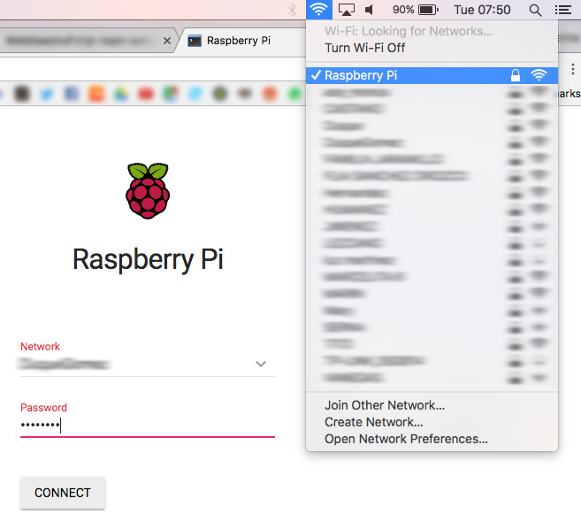

# Raspberry Pi / Roam

This package wirelessly connects a Raspberry Pi to available WiFi networks and bridges the connection to an access point.



## Requirements

You will need a Raspberry Pi 3 and an extra WiFi adapter. For initial setup, you will need to wire your Pi to a router.

The Pi has to be up and running a fresh image of Raspbian. If not, please follow [this installation guide](https://www.raspberrypi.org/documentation/installation/installing-images/README.md).

## Installation

1 - Download this repository.

2 - Use *secure copy* to push the application directory onto the Pi (default password is: *raspberry*).
```
$ scp -r path/to/rpi-roam-webapp/roam pi@raspberrypi.local:.
```

3 - Take control with SSH (default password is: *raspberry*).
```
$ ssh pi@raspberrypi.local
```

4 - Run the setup script.
```
pi@raspberrypi:~ $ sudo bash roam/setup.sh
```

The script will ask for some information.

- **Access Point Name** : The SSID, basically the name of our Pi's WiFi. (default: *Raspberry Pi*)
- **Access Point Password** : The passkey of our Pi's WiFi. [Pick it well](https://strongpasswordgenerator.com/) ! (default: *raspberry*)
- **Access Point Interface** : The interface to bridge to (default: *wlan0*)
- **Adapter Interface** : Our receiver, the one to bridge from (default: *wlan1*)
- **Host Name** : The *.local* address of the Pi. (default: *raspberrypi*)
- **Local Network Address** : "192.168.0" or whatever, just make sure to follow this IP format: three levels only ! (default: *10.0.0*)
- **Application Port** : The port to run the application on. (default: *80*)
- **Application Name** : The title to give to the application page... (default: *Raspberry Pi*)
- **Connection Process Interval** : Interval inbetween each "auto" connection attempt, in minutes. (default: *2*)

It may take some time since it runs `apt-get install` & `apt-get update`.

This package will automatically connect to known available networks.

To save a new network, access the application on the Pi's *.local* host (`http://raspberrypi.local:80` by defaults) and set up the WiFi.

Once connection is made, our Pi will bridge it to our access point.
